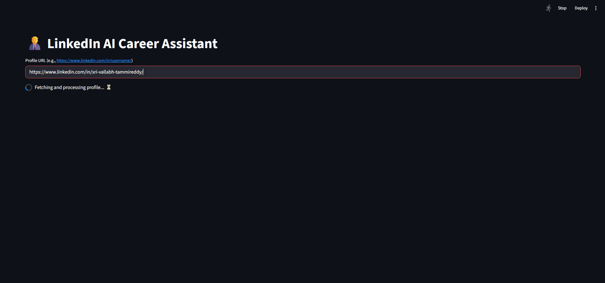
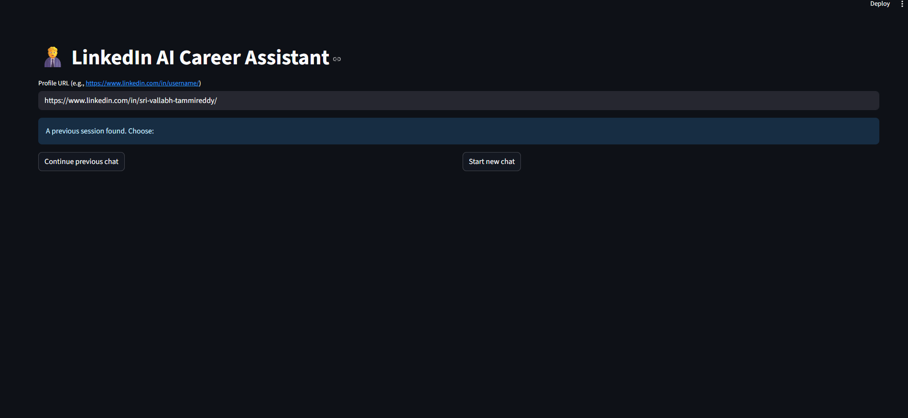
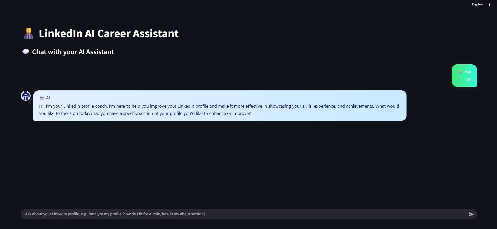
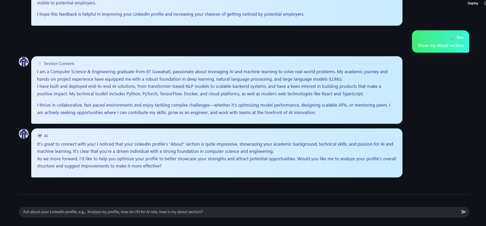
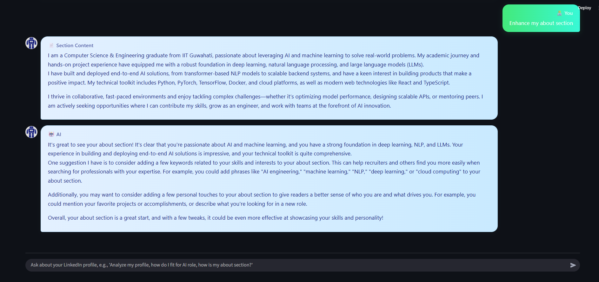
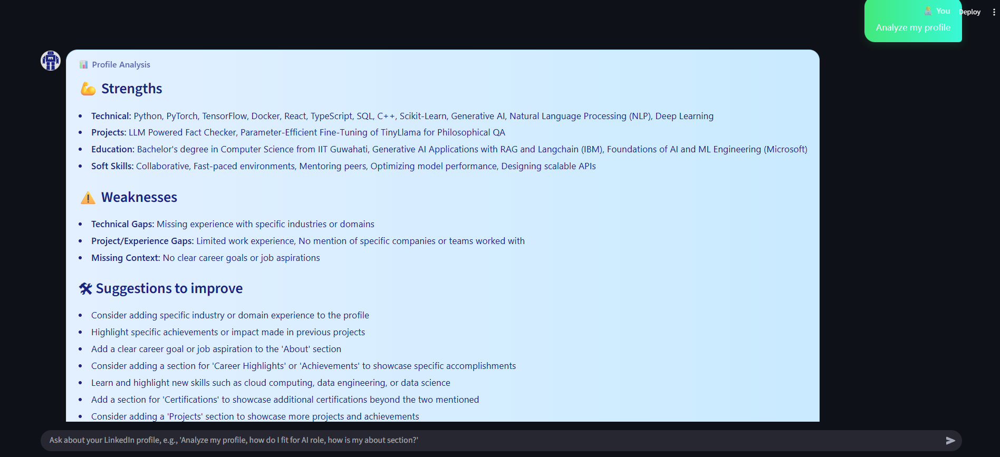
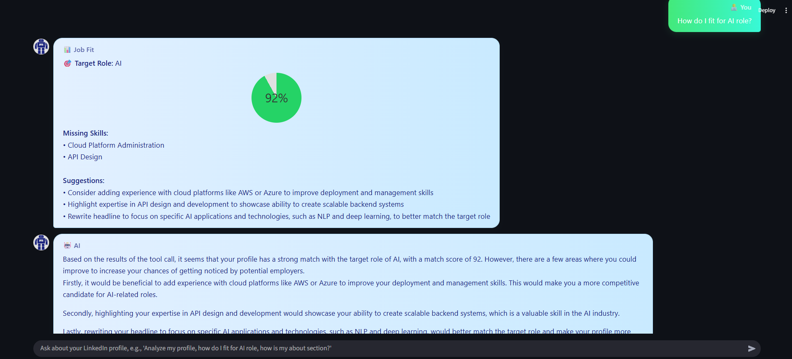

# 🤖 LinkedIn AI Career Assistant

[](https://huggingface.co/spaces/tsrivallabh/Linkedin-Assistant)
[](https://www.python.org/downloads/)
[](https://streamlit.io/)
[](https://langchain-ai.github.io/langgraph/)
[](https://groq.com/)

An intelligent AI-powered career assistant that analyzes LinkedIn profiles, provides job fit analysis, and offers personalized career guidance through an interactive chat interface powered by Groq's llama3-8b-8192 model.

## 🚀 **Live Demo**

Try the application live at: **https://huggingface.co/spaces/tsrivallabh/Linkedin-Assistant**


## 📸 Demonstration

Below are some example screenshots demonstrating key features of the AI LinkedIn Assistant:

## Demonstration


---

  
🔍 **Profile Scraping**: The tool scrapes data from the user's LinkedIn profile URL to create a structured and summarized profile.

---

  
🕘 **History Management**: The user is offered options to **Continue Previous Chat** or **Start New Chat** to manage ongoing or new conversations.

---

  
👋 **Greeting**: The assistant welcomes the user and explains how it can help, creating an engaging start to the conversation.

---


  
📄 **Show Section**: When asked, the assistant retrieves and displays the exact text of a chosen profile section (e.g., *Headline* or *About*).

---

  
✏️ **Enhance Section**: When the user asks to enhance a specific profile section (e.g., *About*), the assistant uses its tools to generate an improved version.

---

  
📊 **Full Profile Analysis**: The assistant performs an in-depth analysis, identifying strengths, weaknesses, and suggesting actionable improvements.

---

  
🎯 **Job Fit Analysis**: The assistant checks how well the user's profile matches a specific target role, showing a match score and missing skills.


All screenshots are stored in the `assets/` folder for clarity and documentation.


## 📋 **Table of Contents**

- [Overview](#overview)
- [Key Features](#key-features)
- [Architecture](#architecture)
- [Installation](#installation)
- [Usage](#usage)
- [Technical Implementation](#technical-implementation)
- [API Keys Setup](#api-keys-setup)
- [Session Management](#session-management)
- [Contributing](#contributing)
- [License](#license)

## 🎯 **Overview**

The LinkedIn AI Career Assistant is a sophisticated career optimization tool that combines Groq's powerful llama3-8b-8192 model with LangGraph's multi-agent framework to provide comprehensive LinkedIn profile analysis. Built using **Streamlit**, **LangGraph**, and **Groq API**, this application offers an interactive chat-based experience for professional career development.

### **What Makes This Special?**

- **🧠 Multi-Agent AI System**: Utilizes LangGraph to orchestrate specialized AI tools for different analysis tasks
- **💾 Thread-Based Sessions**: Maintains conversation context with intelligent thread management based on LinkedIn URLs
- **🎯 Job Fit Analysis**: Provides detailed match scores and improvement suggestions for target roles
- **📊 Profile Analysis**: Comprehensive strengths and weaknesses assessment
- **🔄 Real-time Scraping**: Fetches live LinkedIn profile data using Apify integration
- **⚡ Groq-Powered**: Lightning-fast responses using Groq's optimized llama3-8b-8192 model

## 🌟 **Key Features**

### 1. **Interactive Chat Interface**
- **LinkedIn URL Input**: Simply paste your LinkedIn profile URL to get started
- **Conversational AI**: Natural language interaction for profile optimization
- **Real-time Analysis**: Instant feedback and suggestions as you chat
- **Custom Styling**: Modern chat bubble interface with professional design

### 2. **Comprehensive Profile Analysis**
- **Strengths Identification**: Highlights technical skills, projects, education, and soft skills
- **Weakness Detection**: Identifies gaps in technical skills, experience, and missing context
- **Actionable Suggestions**: Provides specific recommendations for profile enhancement
- **Section-by-Section Access**: Detailed extraction of individual LinkedIn profile sections

### 3. **Advanced Job Fit Analysis**
- **Match Score Calculation**: Quantifies how well your profile fits target roles (0-100%)
- **Skill Gap Analysis**: Identifies missing skills required for your target position
- **Role-Specific Feedback**: Tailored suggestions for improving job compatibility
- **Visual Score Display**: Circular progress indicators for match percentages

### 4. **Intelligent Session Management**
- **URL-Based Threading**: Automatically finds existing conversations for the same LinkedIn profile
- **Session Continuity**: Choose to continue previous chats or start fresh
- **SQLite Persistence**: Robust conversation storage with automatic checkpointing
- **Thread Isolation**: Secure separation of different user sessions

### 5. **Professional Data Handling**
- **Pydantic Validation**: Robust data validation using structured schemas
- **State Management**: Comprehensive state tracking across conversation flows
- **Error Handling**: Graceful handling of API failures and data parsing issues
- **Memory Optimization**: Efficient storage and retrieval of conversation context

## 🏗️ **Architecture**

### **Multi-Agent System Design**

```
┌─────────────────────────────────────────────────────────────┐
│                    User Interface (Streamlit)               │
│                     Custom Chat Interface                   │
└─────────────────────┬───────────────────────────────────────┘
                      │
┌─────────────────────┴───────────────────────────────────────┐
│                   LangGraph Orchestrator                    │
│                    (ChatbotState Schema)                    │
│  ┌─────────────────┬─────────────────┬─────────────────┐    │
│  │   Chatbot Node  │  Profile Tool   │  Job Match Tool │    │
│  │   (Router)      │   (Analyzer)    │   (Matcher)     │    │
│  │                 │                 │                 │    │
│  │  Extract Tool   │                 │                 │    │
│  │  (Section Data) │                 │                 │    │
│  └─────────────────┴─────────────────┴─────────────────┘    │
└─────────────────────┬───────────────────────────────────────┘
                      │
┌─────────────────────┴───────────────────────────────────────┐
│                    External Services                        │
│  ┌─────────────────┬─────────────────┬─────────────────┐    │
│  │  Apify LinkedIn │    Groq API     │   SQLite        │    │
│  │    Scraper      │ (llama3-8b-8192)│  Checkpointer   │    │
│  └─────────────────┴─────────────────┴─────────────────┘    │
└─────────────────────────────────────────────────────────────┘
```

### **Core Components**

1. **ChatBot Node**: Main conversation router with tool calling capabilities
2. **Profile Analyzer**: Comprehensive profile evaluation for strengths and weaknesses
3. **Job Matcher**: Role compatibility analysis with scoring and suggestions
4. **Extract Tool**: Granular access to specific profile sections
5. **State Management**: Pydantic-based ChatbotState with comprehensive field tracking
6. **Thread System**: URL-based session identification and management

## 🛠️ **Installation**

### **Prerequisites**

- Python 3.8 or higher
- pip package manager
- Groq API key
- Apify API token

### **Quick Start**

1. **Clone the Repository**
```bash
git clone https://github.com/Sri-Vallabh/Linkedin-Profile-AI-Assistant.git
cd Linkedin-Profile-AI-Assistant
```

2. **Install Dependencies**
```bash
pip install -r requirements.txt
```

3. **Set Up Environment Variables**
```bash
cp .env.example .env
# Edit .env with your API keys
```

4. **Run the Application**
```bash
streamlit run app.py
```

5. **Access the Application**
```
Open your browser and go to: http://localhost:8501
```

### **Requirements**

```txt
streamlit>=1.28.0
langchain>=0.0.350
langchain-openai>=0.0.8
langgraph>=0.0.55
openai>=1.3.0
pydantic>=2.0.0
python-dotenv>=1.0.0
apify-client>=1.0.0
dirtyjson>=1.0.8
```

## 📖 **Usage**

### **Getting Started**

1. **Launch the Application**
   - Open the application in your browser
   - You'll see the main interface with a LinkedIn URL input field

2. **Enter Your LinkedIn Profile**
   - Paste your LinkedIn profile URL (e.g., `https://www.linkedin.com/in/your-profile/`)
   - The system will automatically scrape and analyze your profile

3. **Choose Session Mode**
   - If a previous session exists, choose to continue or start fresh
   - New sessions initialize with full profile preprocessing

4. **Start Chatting**
   - Begin conversations with queries like:
     - "Analyze my profile strengths and weaknesses"
     - "I want to apply for a Data Scientist role"
     - "Show me my about section"
     - "What skills am I missing for a Software Engineer position?"

### **Available Commands**

- **Profile Analysis**: "Analyze my profile" - Full strengths/weaknesses analysis
- **Job Matching**: "I want to apply for [role]" - Match score and skill gaps
- **Section Access**: "Show me my [section]" - Extract specific profile sections
- **General Queries**: Ask any career-related questions for guidance

### **Sample Conversations**

```
User: "Analyze my LinkedIn profile"
AI: ✅ Profile analysis complete!

💪 Strengths
- Technical: Python, Machine Learning, Data Analysis
- Projects: E-commerce recommendation system, Stock prediction model
- Education: Computer Science degree, Data Science certification
- Soft Skills: Problem-solving, Team collaboration

⚠️ Weaknesses
- Technical Gaps: Cloud computing platforms, MLOps tools
- Project/Experience Gaps: Limited production deployment experience
- Missing Context: Quantified project impacts and metrics

🛠 Suggestions to improve
- Add AWS/Azure cloud certifications
- Include specific metrics for project outcomes
- Highlight leadership or mentoring experiences
```

```
User: "I want to apply for a Senior Data Scientist role"
AI: 📊 Job Fit Analysis

🎯 Target Role: Senior Data Scientist
Match Score: 78%

Missing Skills:
• Deep Learning frameworks (TensorFlow, PyTorch)
• MLOps and model deployment
• Leadership and team management experience

Suggestions:
• Complete online courses in deep learning
• Build projects showcasing end-to-end ML pipelines
• Seek opportunities to lead junior team members
```

## 🔧 **Technical Implementation**

### **State Management**

The application uses a sophisticated Pydantic-based state management system:

```python
class ChatbotState(BaseModel):
    profile: Dict[str, Any]  # Processed LinkedIn profile data
    profile_url: Optional[str]  # Original LinkedIn URL
    sections: Dict[str, str]  # Individual profile sections
    enhanced_content: Dict[str, str]  # Future AI-generated improvements
    profile_analysis: Optional[Dict[str, Any]]  # Strengths/weaknesses
    job_fit: Optional[Dict[str, Any]]  # Job matching results
    target_role: Optional[str]  # User's target job role
    messages: Annotated[List[BaseMessage], add_messages]  # Chat history
    next_tool_name: Optional[str]  # Tool routing information
```

### **Tool Integration**

The system includes three specialized tools:

1. **Profile Analyzer Tool**: 
   - Comprehensive profile evaluation
   - Structured output with strengths, weaknesses, suggestions
   - Uses ProfileAnalysisModel for validation

2. **Job Matcher Tool**: 
   - Role-specific compatibility analysis
   - Calculates match scores (0-100%)
   - Identifies missing skills and provides suggestions

3. **Extract Tool**: 
   - Granular access to profile sections
   - Supports nested data extraction with dot notation
   - Returns structured results for specific queries

### **Session Architecture**

- **Thread Management**: URL-based thread identification for session continuity
- **Checkpointing**: SQLite-based persistent storage with automatic fallback
- **State Validation**: Comprehensive Pydantic validation for data integrity
- **Memory Optimization**: Efficient message history management

### **LLM Integration**

- **Model**: Groq's llama3-8b-8192 for fast, high-quality responses
- **API**: OpenAI-compatible interface through Groq
- **Tool Calling**: Native support for structured tool invocation
- **Error Handling**: Robust retry mechanisms and graceful degradation

## 🔑 **API Keys Setup**

Create a `.env` file in the root directory:

```env
# Groq API Key (required)
GROQ_API_KEY=your_groq_api_key_here

# Apify API Token (required for LinkedIn scraping)
APIFY_API_TOKEN=your_apify_token_here
```

### **Getting API Keys**

1. **Groq API Key**:
   - Visit [Groq Console](https://console.groq.com/)
   - Create an account and generate an API key
   - Used for llama3-8b-8192 model inference

2. **Apify API Token**:
   - Go to [Apify Console](https://console.apify.com/)
   - Sign up and get your API token
   - Used for LinkedIn profile scraping

## 💾 **Session Management**

The application implements intelligent session management:

### **Thread-Based System**
- Each LinkedIn profile URL gets a unique thread ID
- Automatic detection of existing conversations for the same profile
- Secure isolation between different user sessions

### **Conversation Persistence**
- SQLite-based storage for production environments
- Memory-based fallback for development/testing
- Automatic checkpointing after each interaction
- Recovery capability in case of interruptions

### **User Experience**
- Choice to continue previous conversations or start fresh
- Seamless transition between sessions
- Maintained conversation context across browser refreshes

## 🤝 **Contributing**

We welcome contributions to improve the LinkedIn AI Career Assistant! Here's how you can help:

### **Development Setup**

1. Fork the repository
2. Create a feature branch: `git checkout -b feature/your-feature-name`
3. Make your changes and test thoroughly
4. Submit a pull request with a clear description

### **Areas for Contribution**

- **Tool Enhancement**: Implement the commented-out content_generator tool
- **UI/UX Improvements**: Enhance the Streamlit interface design
- **Performance Optimization**: Improve response times and resource usage
- **Testing**: Add comprehensive test coverage
- **Documentation**: Expand examples and API documentation

### **Code Style**

- Follow PEP 8 guidelines for Python code
- Use meaningful variable and function names
- Add docstrings for all functions and classes
- Include type hints where appropriate
- Validate data models with Pydantic

## 📝 **License**

This project is licensed under the MIT License - see the [LICENSE](LICENSE) file for details.

## 🙏 **Acknowledgments**

- **Groq** for providing fast and efficient LLM inference
- **LangChain/LangGraph** for the multi-agent framework
- **Streamlit** for the web application framework
- **Apify** for LinkedIn scraping capabilities
- **Hugging Face** for hosting the live demo

## 📞 **Support**

For questions, issues, or suggestions:

- **Create an Issue**: [GitHub Issues](https://github.com/Sri-Vallabh/Linkedin-Profile-AI-Assistant/issues)
- **Discussions**: [GitHub Discussions](https://github.com/Sri-Vallabh/Linkedin-Profile-AI-Assistant/discussions)
- **Email**: tsrivallabh2014@gmail.com

## 🔄 **Recent Updates**

- **v2.0**: Migrated to Groq API for faster inference
- **Thread Management**: Implemented URL-based session tracking
- **Enhanced UI**: Custom chat interface with professional styling
- **Robust State**: Pydantic-based data validation and error handling
- **Tool Optimization**: Streamlined to three core analysis tools

---

**Built with ❤️ by Sri Vallabh**

*Empowering professionals to optimize their LinkedIn presence and advance their careers through AI-powered insights.*