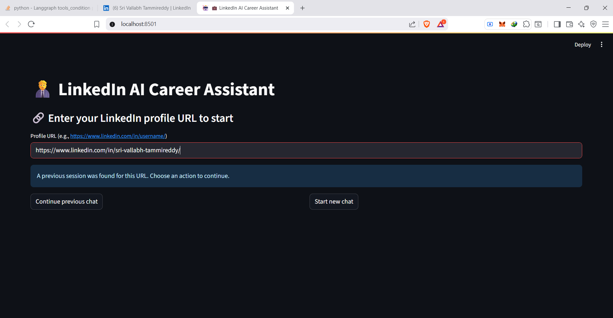
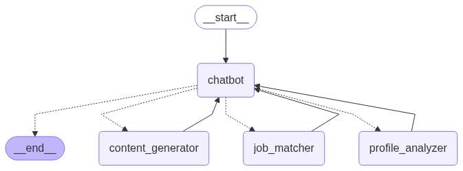

# 🤖 LinkedIn AI Career Assistant

[](https://huggingface.co/spaces/tsrivallabh/Linkedin-AI-Assistant)
[](https://www.python.org/downloads/)
[](https://streamlit.io/)
[](https://langchain-ai.github.io/langgraph/)

An intelligent AI-powered career assistant that helps users optimize their LinkedIn profiles, analyze job fit, and receive personalized career guidance through an interactive chat interface.

## 🚀 **Live Demo**

Try the application live at: **https://huggingface.co/spaces/tsrivallabh/Linkedin-AI-Assistant**


## 📋 **Table of Contents**

- [Overview](#overview)
- [Key Features](#key-features)
- [Architecture](#architecture)
- [Installation](#installation)
- [Usage](#usage)
- [Technical Implementation](#technical-implementation)
- [API Keys Setup](#api-keys-setup)
- [Memory System](#memory-system)
- [Contributing](#contributing)
- [License](#license)

## 🎯 **Overview**

The LinkedIn AI Career Assistant is a comprehensive career optimization tool that combines the power of AI with LinkedIn profile analysis to provide personalized career guidance. Built using **Streamlit**, **LangGraph**, and **OpenAI's GPT models**, this application offers an interactive chat-based experience for users to enhance their professional presence.

### **What Makes This Special?**

- **🧠 Multi-Agent AI System**: Utilizes LangGraph to orchestrate specialized AI agents for different tasks
- **💾 Persistent Memory**: Maintains conversation context across sessions using advanced checkpointing
- **🎯 Job Fit Analysis**: Provides detailed match scores and improvement suggestions for target roles
- **✨ Profile Enhancement**: Generates AI-powered rewrites of profile sections
- **🔄 Real-time Scraping**: Fetches live LinkedIn profile data using Apify integration

## 🌟 **Key Features**

### 1. **Interactive Chat Interface**


- **LinkedIn URL Input**: Simply paste your LinkedIn profile URL to get started
- **Conversational AI**: Natural language interaction for profile optimization
- **Real-time Analysis**: Instant feedback and suggestions as you chat
- **Guided Experience**: Step-by-step assistance for profile improvement

### 2. **Comprehensive Profile Analysis**
- **Strengths Identification**: Highlights your technical skills, projects, education, and soft skills
- **Weakness Detection**: Identifies gaps in technical skills, experience, and missing context
- **Actionable Suggestions**: Provides specific recommendations for profile enhancement
- **Section-by-Section Review**: Detailed analysis of each LinkedIn profile section

### 3. **Advanced Job Fit Analysis**


- **Match Score Calculation**: Quantifies how well your profile fits target roles (0-100%)
- **Skill Gap Analysis**: Identifies missing skills required for your target position
- **Industry Comparison**: Compares your profile against industry standards
- **Improvement Roadmap**: Provides specific steps to increase job match score

### 4. **AI-Powered Content Generation**


- **Section Rewriting**: Generates enhanced versions of About, Headlines, and other sections
- **Role-Specific Optimization**: Tailors content to specific job roles and industries
- **Professional Tone**: Ensures content maintains professional standards
- **Keyword Optimization**: Incorporates relevant industry keywords for better visibility

### 5. **Persistent Memory System**


- **Session Continuity**: Remembers your conversation history across browser sessions
- **Profile State Tracking**: Maintains your profile analysis and enhancements
- **Goal Retention**: Remembers your career goals and target roles
- **SQLite/Memory Storage**: Robust storage system for conversation persistence

## 🏗️ **Architecture**


### **Multi-Agent System Design**

```


┌─────────────────────────────────────────────────────────────┐
│                    User Interface (Streamlit)               │
└─────────────────────┬───────────────────────────────────────┘
                      │
┌─────────────────────┴───────────────────────────────────────┐
│                   LangGraph Orchestrator                    │
│  ┌─────────────────┬─────────────────┬─────────────────┐    │
│  │   Chat Agent    │  Profile Agent  │  Content Agent  │    │
│  │   (Router)      │   (Analyzer)    │  (Generator)    │    │
│  └─────────────────┴─────────────────┴─────────────────┘    │
└─────────────────────┬───────────────────────────────────────┘
                      │
┌─────────────────────┴───────────────────────────────────────┐
│                    Tool Layer                               │
│  ┌─────────────────┬─────────────────┬─────────────────┐    │
│  │ Profile Analyzer│  Job Matcher    │Content Generator│    │
│  │    Tool         │     Tool        │     Tool        │    │
│  └─────────────────┴─────────────────┴─────────────────┘    │
└─────────────────────┬───────────────────────────────────────┘
                      │
┌─────────────────────┴───────────────────────────────────────┐
│                External Services                            │
│  ┌─────────────────┬─────────────────┬─────────────────┐    │
│  │  Apify LinkedIn │    OpenAI       │   SQLite        │    │
│  │    Scraper      │     API         │  Checkpointer   │    │
│  └─────────────────┴─────────────────┴─────────────────┘    │
└─────────────────────────────────────────────────────────────┘
```

### **Core Components**

1. **ChatBot Node**: Main conversation router that decides which tools to use
2. **Profile Analyzer**: Evaluates profile strengths, weaknesses, and provides suggestions
3. **Job Matcher**: Compares profiles against target roles and calculates match scores
4. **Content Generator**: Creates enhanced versions of profile sections
5. **State Management**: Maintains conversation context and user data
6. **Memory System**: Persists data across sessions using SQLite/Memory checkpointers

## 🛠️ **Installation**

### **Prerequisites**

- Python 3.8 or higher
- pip package manager
- OpenAI API key (using Groq endpoint)
- Apify API token

### **Quick Start**

1. **Clone the Repository**
```bash
git clone https://github.com/yourusername/linkedin-ai-assistant.git
cd linkedin-ai-assistant
```

2. **Install Dependencies**
```bash
pip install -r requirements.txt
```

3. **Set Up Environment Variables**
```bash
cp .env.example .env
# Edit .env with your API keys
```

4. **Run the Application**
```bash
streamlit run main.py
```

5. **Access the Application**
```
Open your browser and go to: http://localhost:8501
```

### **Requirements**

```txt
streamlit>=1.28.0
langchain>=0.0.350
langchain-openai>=0.0.8
langgraph>=0.0.55
openai>=1.3.0
pydantic>=2.0.0
python-dotenv>=1.0.0
apify-client>=1.0.0
dirtyjson>=1.0.8
sqlite3
hashlib
```

## 📖 **Usage**

### **Getting Started**

1. **Launch the Application**
   - Open the application in your browser
   - You'll see the main interface with a LinkedIn URL input field

2. **Enter Your LinkedIn Profile**
   - Paste your LinkedIn profile URL (e.g., `https://www.linkedin.com/in/your-profile/`)
   - The system will automatically scrape and analyze your profile

3. **Start Chatting**
   - Begin conversations with queries like:
     - "Analyze my profile strengths and weaknesses"
     - "I want to apply for a Data Scientist role"
     - "Help me improve my About section"
     - "What skills am I missing for a Software Engineer position?"

### **Sample Conversations**

```
User: "Analyze my LinkedIn profile"
AI: "I've analyzed your profile! Here are your key strengths:
    - Strong technical skills in Python, Machine Learning
    - Solid project portfolio with 3 major data science projects
    - Educational background in Computer Science
    
    Areas for improvement:
    - Add more specific metrics to your achievements
    - Include cloud computing skills (AWS, Azure)
    - Enhance your headline for better visibility"

User: "I want to apply for a Senior Data Scientist role"
AI: "Great! Let me analyze how well your profile fits a Senior Data Scientist position.
    
    📊 Match Score: 78%
    
    Missing Skills: Deep Learning frameworks, MLOps, Leadership experience
    
    Suggestions:
    • Add experience with TensorFlow/PyTorch
    • Highlight any team leadership or mentoring experience
    • Include examples of model deployment and monitoring"
```

### **Advanced Features**

- **Session Persistence**: Your conversations are saved automatically
- **Profile Enhancement**: Request AI-generated improvements for any section
- **Job Matching**: Compare your profile against multiple target roles
- **Career Guidance**: Get suggestions for skill development and career progression

## 🔧 **Technical Implementation**

### **State Management**

The application uses a sophisticated state management system powered by Pydantic models:

```python
class ChatbotState(BaseModel):
    profile: Dict[str, Any]  # Processed LinkedIn profile data
    sections: Dict[str, str]  # Individual profile sections
    enhanced_content: Dict[str, str]  # AI-generated improvements
    profile_analysis: Optional[Dict[str, Any]]  # Strengths/weaknesses analysis
    job_fit: Optional[Dict[str, Any]]  # Job matching results
    target_role: Optional[str]  # User's target job role
    chat_history: List[BaseMessage]  # Conversation history
```

### **Tool Integration**

The system includes four specialized tools:

1. **Profile Analyzer Tool**: Comprehensive profile evaluation
2. **Job Matcher Tool**: Role-specific compatibility analysis
3. **Content Generator Tool**: AI-powered section rewriting
4. **Extract Tool**: Data retrieval from application state

### **Memory Architecture**

- **Session Memory**: Temporary storage for active conversations
- **Persistent Memory**: SQLite-based storage for cross-session continuity
- **Thread Management**: Unique thread IDs for each user session
- **State Checkpointing**: Automatic saving of conversation state

## 🔑 **API Keys Setup**

Create a `.env` file in the root directory:

```env
# OpenAI API (using Groq endpoint)
GROQ_API_KEY=your_groq_api_key_here

# Apify API for LinkedIn scraping
APIFY_API_TOKEN=your_apify_token_here
```

### **Getting API Keys**

1. **Groq API Key**:
   - Visit [Groq Console](https://console.groq.com/)
   - Create an account and generate an API key
   - This is used for OpenAI-compatible LLM inference

2. **Apify API Token**:
   - Go to [Apify Console](https://console.apify.com/)
   - Sign up and get your API token
   - Used for LinkedIn profile scraping

## 💾 **Memory System**

The application implements a sophisticated memory system:

### **Session Persistence**
- Conversations are automatically saved to SQLite database
- Users can continue previous conversations seamlessly
- Profile analysis and enhancements persist across sessions

### **Thread Management**
- Each LinkedIn profile gets a unique thread ID
- Multiple users can use the application simultaneously
- Thread-based isolation ensures data privacy

### **State Checkpointing**
- Automatic saving of conversation state after each interaction
- Recovery capability in case of unexpected interruptions
- Efficient storage using LangGraph's checkpointing system

## 🤝 **Contributing**

We welcome contributions to improve the LinkedIn AI Career Assistant! Here's how you can help:

### **Development Setup**

1. Fork the repository
2. Create a feature branch: `git checkout -b feature/your-feature-name`
3. Make your changes and test thoroughly
4. Submit a pull request with a clear description

### **Areas for Contribution**

- **New Analysis Features**: Add more sophisticated profile analysis capabilities
- **UI/UX Improvements**: Enhance the Streamlit interface
- **Performance Optimization**: Improve response times and resource usage
- **Documentation**: Expand documentation and examples
- **Testing**: Add comprehensive test coverage

### **Code Style**

- Follow PEP 8 guidelines for Python code
- Use meaningful variable and function names
- Add docstrings for all functions and classes
- Include type hints where appropriate

## 📝 **License**

This project is licensed under the MIT License - see the [LICENSE](LICENSE) file for details.

## 🙏 **Acknowledgments**

- **OpenAI** for providing the GPT models
- **LangChain/LangGraph** for the multi-agent framework
- **Streamlit** for the web application framework
- **Apify** for LinkedIn scraping capabilities
- **Hugging Face** for hosting the live demo

## 📞 **Support**

For questions, issues, or suggestions:

- **Create an Issue**: [GitHub Issues](https://github.com/Sri-Vallabh/Linkedin-Profile-AI-Assistant/issues)
- **Discussions**: [GitHub Discussions](https://github.com/Sri-Vallabh/Linkedin-Profile-AI-Assistant/discussions)
- **Email**: tsrivallabh2014@gmail.com

---

**Built with ❤️ by Sri vallabh**

*Empowering professionals to optimize their LinkedIn presence and advance their careers through AI-powered insights.*